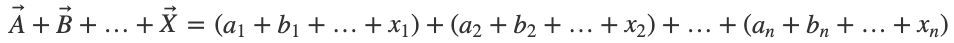
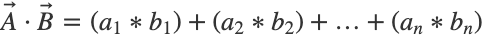

# Numpy Basics

Numpy's meaning is "Numeric Python", and it's indeed optimized to get all the numeric operations simple and faster than normal python, without using loops and another slow operations.

But Numpy also treats its arrays and other things as mathematical objects, differently than python. Then, let's figure out how numpy do that.

Note: working examples of Numpy basics are [here](https://github.com/SrChach/numpy_stack_and_algorithms/blob/master/numpy/basics.py)

## Differences betwen numpy and python arrays

Although Numpy has arrays like python, it doesn't handle they the same way. For example operations like following will work in python, but not in Numpy.

``` python
some_list = [1, 2, 3]

some_list.append(4)
some_list = some_list + [ 5, 6 ]
```

So, what's special about Numpy?

# Vectors

## Vector Addition

While "+" between arrays into Python means concatenation, in Numpy it means vector sum.

Recalling that vector sum's formula is:


If we indicates vectorial sum between two Numpy arrays, it will sum all the posicions into array, term by term as following.

``` python
numpy_vector = numpy.array([1, 2, 3])

# Will print [2, 4, 6]
print(numpy_vector + numpy_vector)
```

Notice that if *"numpy_vector"* were a *N* dimensions array, Numpy would also print the sum of vectors.

## Multiplying vector by scalar

In the case of multiplication, whereas multiplicate an array by a number *X* will return us the array concatenated *N* times in python, a Numpy vector will return the Vector multiplied by the *X* scalar

Remembering that Vector by Scalar formula is:


Which means the *X* constant will multiply **every** element in the vector.

``` python
N = 2

# will print a vector multiplied by the scalar "N"
print(numpy_vector * N)
```

## Multiplication betwen vectors

We can also do a multiplication between arrays. What this operation does is multiplicate each element by all the arrays, term by term, and returns to ours a new array with the content of this multiplication, with the same size of the input arrays.

This means that we can't multiply arrays with different sizes.

``` python
A_vector = numpy.array([1, 2, 3])
B_vector = numpy.array([2, 1, 8])
C_vector = numpy.array([5, 5, 0])
# components of vector  ^  ^  ^
#                       1  2  3

# Will print [10, 10, 0] because it's the sum component by component
print(A_vector * B_vector * C_vector)
```

## Other operations

We can also do another methematical operations to the Numpy vectors in a simple way.

Some examples of this can be:

``` python
# Squaring each element in the vector
print( numpy_vector ** 2 )

# Getting the square root of every element in vector
print( numpy.sqrt(numpy_vector))

# Getting the Logarithm of 
print( numpy.log(numpy_vector) )

# Getting e^(N) of each element
print( numpy.exp(numpy_vector) )
```

## Dot product

The Dot Product is an operation between vectors that give us a scalar product, and there are two forms to get it.

Note: working examples of Dot Product are [here](https://github.com/SrChach/numpy_stack_and_algorithms/blob/master/numpy/dot.py)

One of the ways to get the dot product is using the formula 


In which we need to multiply all the posicion components of each vector, and then sum all the results, in order to get a scalar number. 

First we need to get the multiplication of these vectors. Since vector multiplication gives us another vector, then we can sum the result in a simple way.

``` python
multiplied_vector = A_vector * B_vector

dot_result = numpy.sum(multiplied_vector)
```

Or we can just use the built-in formula for *dot product* into Numpy

``` python
dot_result = A_vector.dot(B) # numpy.dot(A_vector, B_vector) also works
```

And there's the result of our first dot product.

## Getting the normal from a vector

The normal or magnitude of a vector is simply its length. As we know, one vector can have many dimensions, so we need a formula to get its length. This is


So, let's get the magnitude!

``` python
# Using the formula
magnitude = numpy.sqrt( A_vector ** 2 )

# Using the linear algebra Numpy's module, which has the "normal" operation
magnitude = numpy.linalg.norm(A_vector)
```

## Getting angle between two vectors

Well, we now need to get the angle between two vectors. This can be done appying an arccos to the result of the formula:


Int the above example, we learned how to get the magnitude of a vector and we'll apply it into the formula.

``` python
# Getting the cosine
cos_of_the_angle = U_vector.dot(V_vector) / ( numpy.linalg.norm(U_vector) * numpy.linalg.norm(V_vector) )
```

And then, we only need to use the arccos function that comes with numpy to get the angle.

``` python
angle = numpy.arccos( cos_of_the_angle )
```

And we've got our angle!

# Matrices

Note: Examples of Matrices are [here](https://github.com/SrChach/numpy_stack_and_algorithms/blob/master/numpy/matrices.py)

## Matrix definition

Within Numpy, a Vector can be considered as a one-dimension array. And, as into another languages and frameworks, a Matrix is just a two-dimensional array. So we can think in a matrix as a two-dimensional vector.

So, to summarize we're only talking about 1-D arrays and 2-D arrays. Or, we can also think in it as a list of lists.

We can define a Numpy matrix in two ways (Notice that the inner arrays must have the same size).

``` python
# As an numpy array of arrays
array_matrix = numpy.array([ [1, 2], [3, 4] ])

# Or directly as a Matrix
real_matrix = numpy.matrix([ [1, 2], [3, 4] ])
```

Same with the "same" result (there's a little difference between matrices and arrays in Numpy, but we can use the same operations in both).

But the Numpy's official documentation recommends use arrays instead of matrices. So we'll try to convert all the matrices as possible into arrays, sometimes using following operation.

``` python
# Converting Matrix into matrix/array (recommended)
matrix = numpy.array(real_matrix)
```

## Accessing to a Matrix element

We can acces to a group or element of the matrix in two ways. Use the one you like.

``` python
# First form, as we're used to access to an element
element = matrix[0][0]

# and we can use something like Matlab's syntax
element = matrix[0, 0]
```

## Generating arrays

Sometimes we need to generate arrays. Long arrays, arrays with random elements... uff. So we need a quick way to do this.

First form is create an array full of zeros in every position.

```python
number_of_zeros = 10

# will return us an array of length "number_of_zeros"
array_full_of_zeros = numpy.zeros( number_of_zeros )

# Will return us an array of size 10 X 10, full of zeros
# Notice the input still takes in one input, which is a tuple containing each dimension
matrix_full_of_zeros = numpy.zeros( (10, 10) )

# A similar function, but filling all the elements with "1"
matrix_full_of_ones = numpy.ones( (10, 10) )
```

Another form is making a matrix with random elements, with different distributions.

``` python
# Generating an array with random numbers between 0 and 1
random_matrix = numpy.random.random( (10, 10) )

# We can also generate an array with random numbers, but in Gaussian Distribution 
matrix_random_gaussian = numpy.random.randn  ( 10, 10 )
```

And, for each of these matrices, we can calculate its statistics, for example and taking the above matrix

``` python
# Getting the Mean of a matrix
print("Mean of a given matrix: ", matrix_random_gaussian.mean()

# Getting the Variance of a matrix
print("Variance of a given matrix: ", matrix_random_gaussian.var())
```

## Matrix multiplication

It's important to see that element by element multiplication is not the same that matrix multiplication. Where **element by element** multiplication formula is


> Note: matrices to multiplicate must have **exactly** the same size

and in Numpy is represented by an *asterisk*

``` python
result_matrix = A_matrix * B_matrix
```

It's not the same that Matrix Multiplication, that is defined by


and its represented in Numpy as *dot*.

``` python
result_matrix_multiplication = A_matrix.dot(B_matrix)
```

> Notice that *dot* between matrices, representing **matrix multiplication** has not the same effect that the *dot* between vectors, that represents **dot product**, even though they're represented by the same operation.

Matrix multiplication has a special requirement, and that's that the inner dimensions of the two matrices you're multiplying must match. For example, look at the following two matrices.

|Matrix|Size|
|:---:|:--:|
|A|2 X 3|
|B|3 X 3|

In this case, we can multiply *AB*, because it´s (2 X ***3)<--->(3*** X 3) and the inner values are equivalent *(3 = 3)*, but we can't multyply *BA* because they're (3 X ***3)<--->(2*** X 3), and its inner dimension isn't equivalent *(2 ≠ 3)*.

This is because, the definition of matrix multiplication. Consider A and B as the matrices to multiply.


The above rule is due *(i, j)th* entry of *result_matrix* is the dot product of row **A(i, :)** and column **B(:, j)**.

## More matrix operations

this topic is pending for documenting, but not for coding

## Resolving a Linear System

The problem from a linear system is 

> ***Ax = b***

Where *A* is the matrix, *x* is the column vector we're trying to solve for, and *b* is a vector of numbers. 

And the solution for this problem is multiply both sides by the inverse


Resolving this is possible by assuming that *A* is a square matrix, meaning that if it's invertible, then *x* has an unique solution, or:

- It's a system with D equations and D unknowns
- *A* is DxD size, assume it is invertible
- We have all the tools we need to solve already:
  - matrix inverse
  - matrix multiply (dot product)

Then, to summarize we need to multiply the matrix's inverse in dot product by the vector.

``` python
# Defining matrix and vector from system
matrix = numpy.array([
		[1, 2],
		[3, 4]	
	])

vector = numpy.array([1, 2])

# getting the inverse of the matrix
inverse = numpy.linalg.inv(matrix)

# getting the result by using dot product
solution = inverse.dot(vector)
```

Or we can resolve it by using the `solve` method.

``` python
#Getting the solution by using the "linalg.solve() method"
solution = numpy.linalg.solve(matrix, vector)
```

> By speed and manage of errors, try to *always* use "solve" instead of inverse method.

## A real example of linear equation solving

Well, once obtained all these knowledge, we need to practice it by a real-world example. So, let's resolve a problem.

> The admission fee at a small fair is $1.50 for children and $4.00 for adults. On a certain day, 2200 people enter the fair, and $5050 is collected. How many children and how many adults attended?

We need first raise an equation to describe the problem. 
Let's call the **number of children** as ***Ch*** and the **number of adults** as ***Ad***.

``` python
# This square of code is only an example, not runnable code

# Between Childrens and Adults, it was an attendance of 2200 people.
Ch + Ad = 2200

# And collecting $1.50 by children and $4.00 by adult, there was $5050 dollars.
(1.5 * Ch) + (4 * Ad) = 5050 
```


Two unknowns, two equations.

So, let's plug this into Numpy and find the solution.

``` python
matrix = numpy.array([
		[1, 1],
		[1.5, 4]
	])

vector = numpy.array([2200, 5050])

solution = np.linalg.solve(matrix, vector)
```

And that gives us the array **[1500, 700]** that means there was **1500 children** and **700 adults**.

[<< Back to Index](https://github.com/SrChach/python_data_structures#Index)